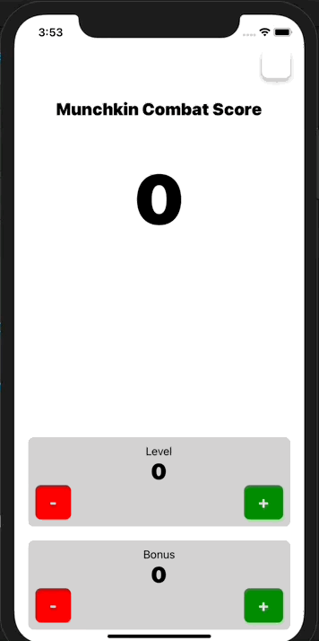

# MunchkinLevelCounter-RN
Simple Munchkin board game level counter app built with React Native
  

TODO:

  • Re-factor components into their own files.
  
  • Figure out the appropriate way to pass down state and dispatch from useReducer to children components.
